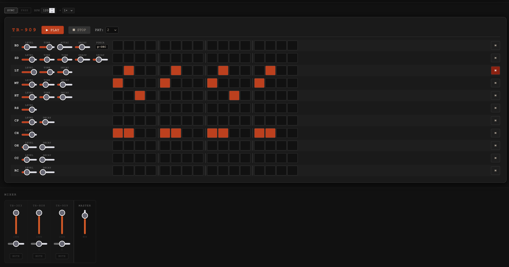
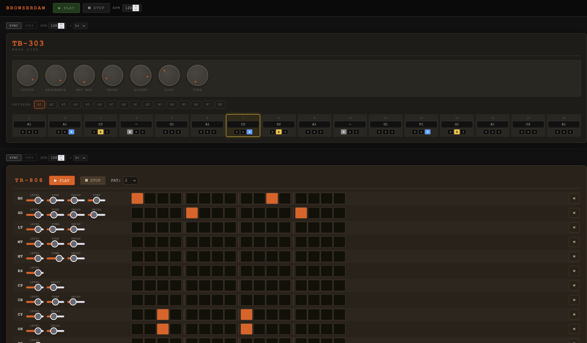

# BrowserDAW

A browser-based drum machine and bassline emulator. Three classic instruments running together on a single page, synchronized to a shared clock — no plugins, no dependencies, no build step.





## Instruments

**TB-303 Bass Line** — Sawtooth oscillator through a resonant ladder filter with envelope modulation, accent, slide, and distortion. 16 patterns × 16 steps, rotary knob controls, per-step note editor.

**TR-808 Rhythm Composer** — 16-voice drum synthesizer. All voices synthesized in Web Audio: sine sweep bass drum, tuned toms, noise snare, metallic hats and cymbals using multi-oscillator additive banks. 16 patterns × 16 steps with accent (velocity) per step.

**TR-909 Rhythm Composer** — 11-voice drum synthesizer with a harder, more industrial character than the 808. Includes the 909's distinctive sawtooth bass drum with optional prolonged decay, detuned triangle snare, and noise-based cymbals. 16 patterns × 16 steps.

## Running it

```
open index.html
```

No server required. Open the file directly in a browser.

## How it works

All three instruments share a single **Web Audio clock** and **mixer bus**. The global transport in the header starts and stops everything together. Each instrument can also be started and stopped independently — the others keep playing.

### Transport
- **PLAY / STOP** in the header controls all three instruments simultaneously
- Each instrument's own PLAY / STOP controls only that instrument; the shared clock keeps running for the others
- Stopping and restarting an individual instrument resets it to step 1

### BPM and sync
Each instrument has a **SYNC / FREE** mode toggle and a BPM display:
- **SYNC** (default) — the instrument locks to the master BPM shown in the header. Changing any SYNC device's BPM changes the master, and all other SYNC devices update to match
- **FREE** — the instrument runs at its own independent BPM, unaffected by master BPM changes (displayed in green)
- The **×** multiplier (½×, 1×, 2×) scales a SYNC device's step rate relative to master

### Step sequencer
- Click a step button once for **on** (orange/red)
- Click again for **accent** (yellow) — a harder hit
- Click again to turn it **off**
- Arrow keys step the BPM inputs up/down; hold Shift for ±10

### TB-303 specifics
- Click a step's note label to open the note editor
- **R** — rest (step is silent)
- **A** — accent
- **S** — slide (portamento into the next note)

### Mixer
The mixer at the bottom has a channel strip for each instrument plus a master:
- Vertical fader — volume
- Horizontal slider — pan
- MUTE button

## Browser compatibility

Requires Web Audio API support. Works in current versions of Chrome, Firefox, and Safari. Not tested in mobile browsers.

## Architecture notes

Vanilla JavaScript, no framework, no bundler. Global namespaces (`DAW`, `TB303`, `TR808`, `TR909`). All synthesis is done entirely in Web Audio — no audio samples are used anywhere.

```
js/
  clock.js      — shared lookahead rAF scheduler, per-device pause/resume
  mixer.js      — AudioContext owner, channel strips, master bus, recording
  mixer-ui.js   — mixer DOM
  app.js        — global transport, BPM sync, clock strip wiring
instruments/
  tb303/        — constants, patterns, synth, sequencer, ui, main
  tr808/        — constants, voices, patterns, sequencer, ui, main
  tr909/        — constants, voices, patterns, sequencer, ui, main
```

## Planned

- Save session audio to disk
- Per-channel effects (reverb, delay)
- Per-channel recording and audio export
